# Quick-Query Architecture

This document describes the architecture of Quick-Query (`qq`), a fast, extensible CLI for interacting with Large Language Models.

## Table of Contents

1. [Design Philosophy](#design-philosophy)
2. [Crate Structure](#crate-structure)
3. [Core Abstractions](#core-abstractions)
4. [Execution Flows](#execution-flows)
5. [Configuration Architecture](#configuration-architecture)
6. [Tool System](#tool-system)
7. [Agent System](#agent-system)
8. [TUI Architecture](#tui-architecture)
9. [Extension Points](#extension-points)
10. [Design Decisions](#design-decisions)

---

## Design Philosophy

Quick-Query is built on several core principles:

| Principle | Implementation |
|-----------|----------------|
| **Pure Rust** | No ncurses dependency; terminal handling via crossterm/ratatui |
| **Streaming-First** | All LLM interactions support streaming by default |
| **Parallel Execution** | Tools execute concurrently; multiple agent calls can run in parallel |
| **Provider Agnostic** | Works with any OpenAI-compatible API |
| **Security by Default** | Filesystem sandboxing, write-disabled by default, no credential storage |

---

## Crate Structure

### Dependency Graph

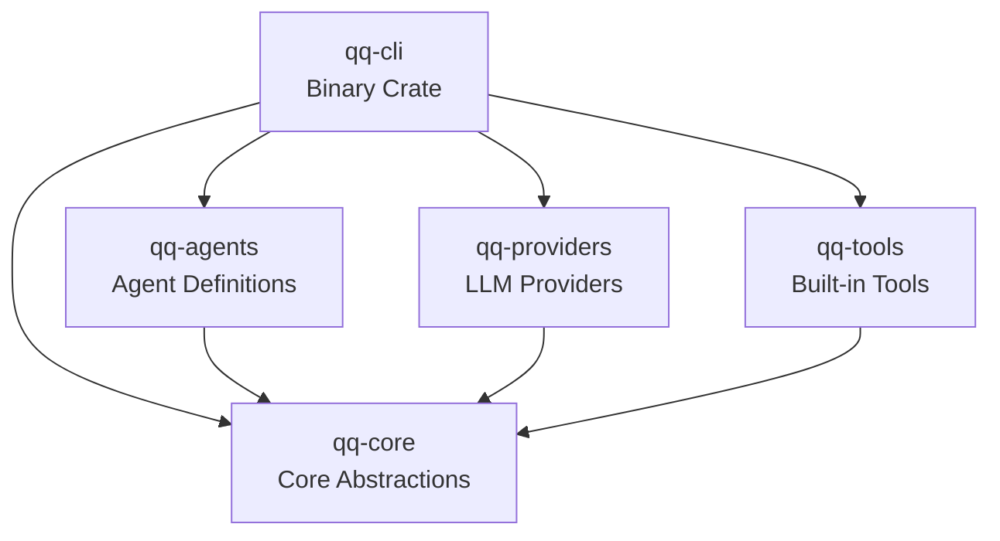

### Crate Responsibilities

| Crate | Purpose | Key Exports |
|-------|---------|-------------|
| **qq-core** | Foundation types and traits | `Provider`, `Tool`, `Agent`, `Message`, `ToolRegistry` |
| **qq-providers** | LLM provider implementations | `OpenAIProvider` |
| **qq-tools** | Built-in tools for agents | `create_filesystem_tools`, `create_memory_tools`, `create_web_tools` |
| **qq-agents** | Agent definitions | `ChatAgent`, `CoderAgent`, `ExploreAgent`, etc. |
| **qq-cli** | User-facing CLI binary | `qq` binary, TUI, configuration loading |

---

## Core Abstractions

### Message Model

Messages are the fundamental unit of LLM communication:

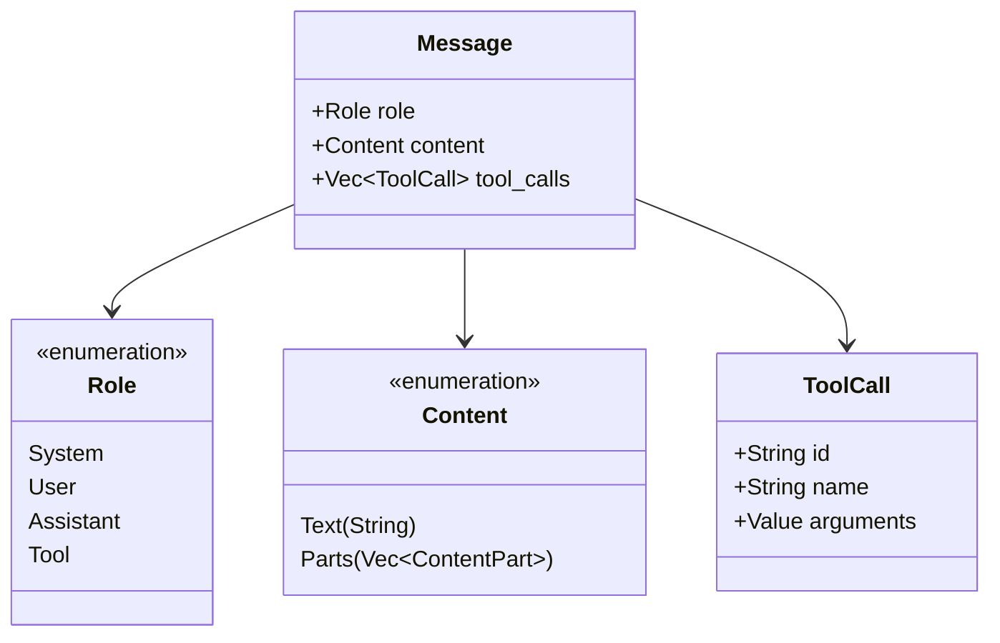

### Provider Trait

The `Provider` trait abstracts LLM interactions:

```rust
#[async_trait]
pub trait Provider: Send + Sync {
    fn name(&self) -> &str;
    fn default_model(&self) -> Option<&str>;

    async fn complete(&self, request: CompletionRequest) -> Result<CompletionResponse, Error>;
    async fn stream(&self, request: CompletionRequest) -> Result<StreamResult, Error>;

    fn supports_tools(&self) -> bool;
    fn supports_vision(&self) -> bool;
}
```

### Tool Trait

Tools are executable capabilities exposed to LLMs:

```rust
#[async_trait]
pub trait Tool: Send + Sync {
    fn name(&self) -> &str;
    fn description(&self) -> &str;
    fn definition(&self) -> ToolDefinition;

    async fn execute(&self, arguments: Value) -> Result<ToolOutput, Error>;
}
```

### Agent Framework

Agents coordinate LLM calls and tool execution:

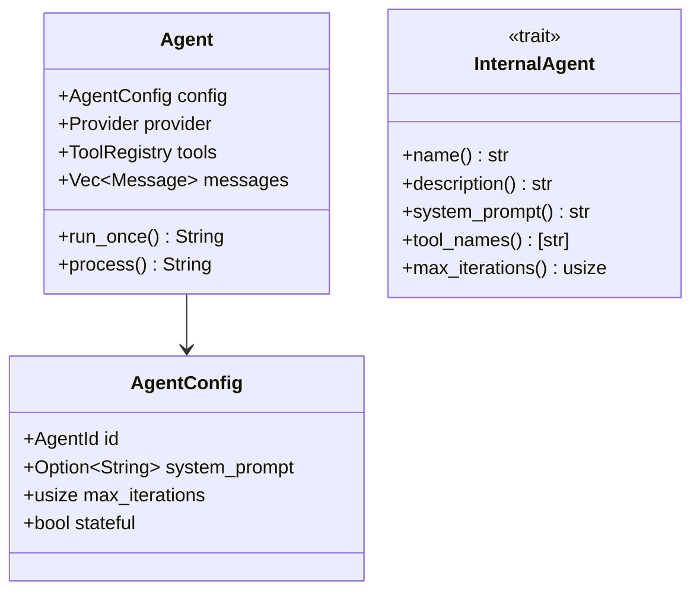

---

## Execution Flows

### One-Shot Completion Flow

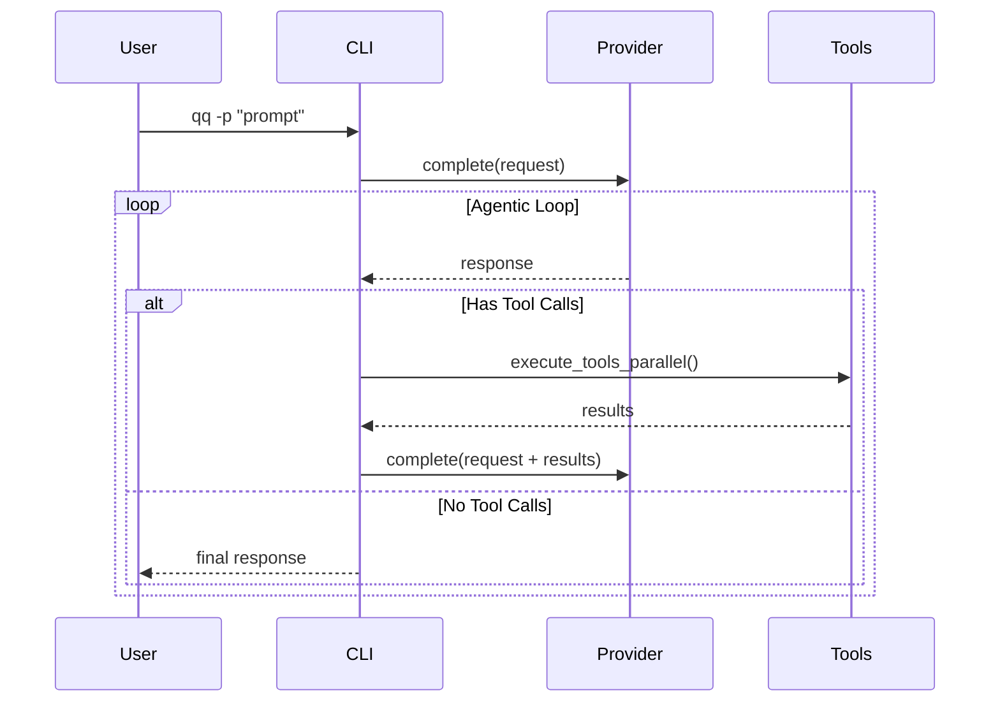

### Interactive Chat Flow (TUI)

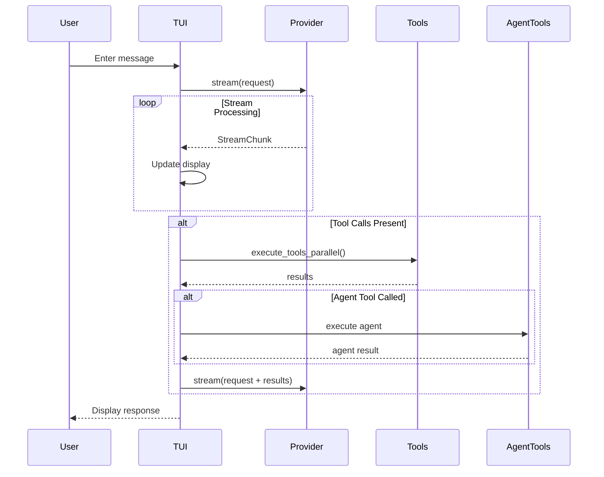

### Agentic Loop Detail

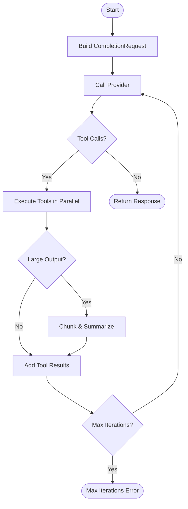

---

## Configuration Architecture

### Layered Resolution

Configuration is resolved in layers, with later layers overriding earlier ones:

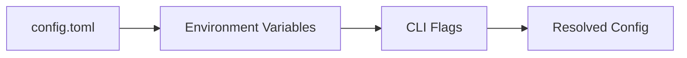

### Profile System

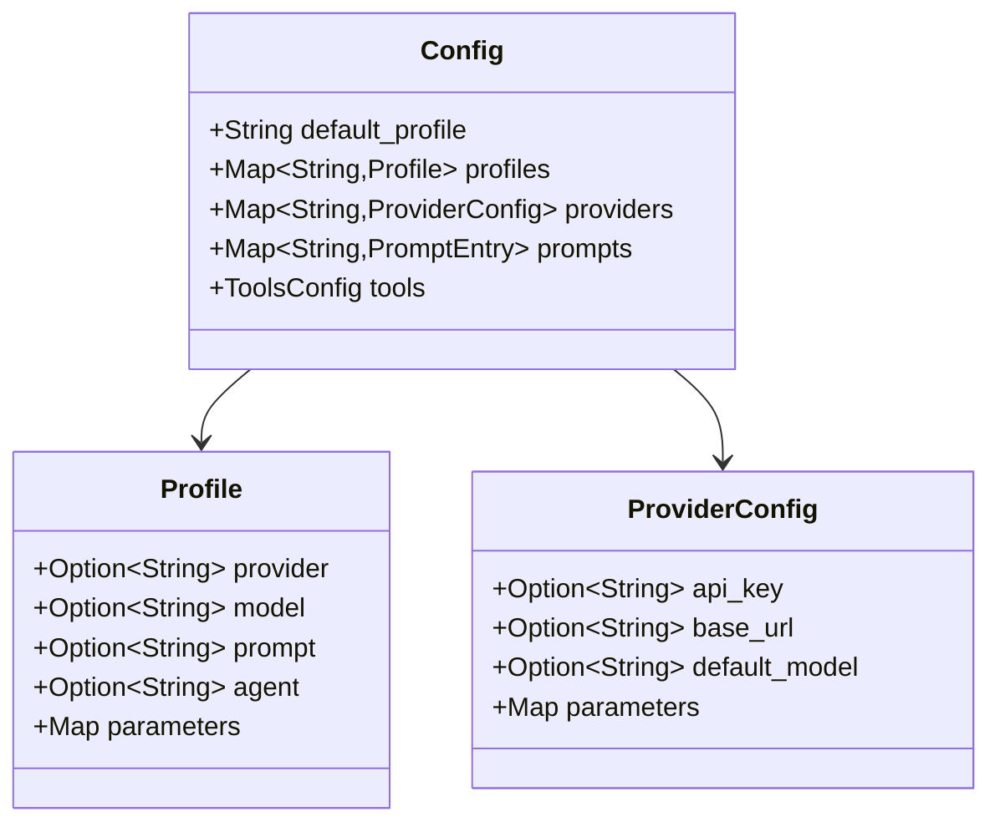

### Configuration File Structure

```toml
# Profile used when none specified
default_profile = "default"

# Provider configurations
[providers.openai]
api_key = "sk-..."  # Or use OPENAI_API_KEY env var
base_url = "https://api.openai.com/v1"
default_model = "gpt-4o"

# Named prompts
[prompts.coding]
prompt = "You are an expert programmer..."

# Profile definitions
[profiles.default]
provider = "openai"
model = "gpt-4o"

[profiles.coding]
provider = "openai"
prompt = "coding"
agent = "coder"

# Tool configuration
[tools]
root = "$PWD"
allow_write = false
enable_filesystem = true
enable_memory = true
enable_web = true
```

---

## Tool System

### Security Model

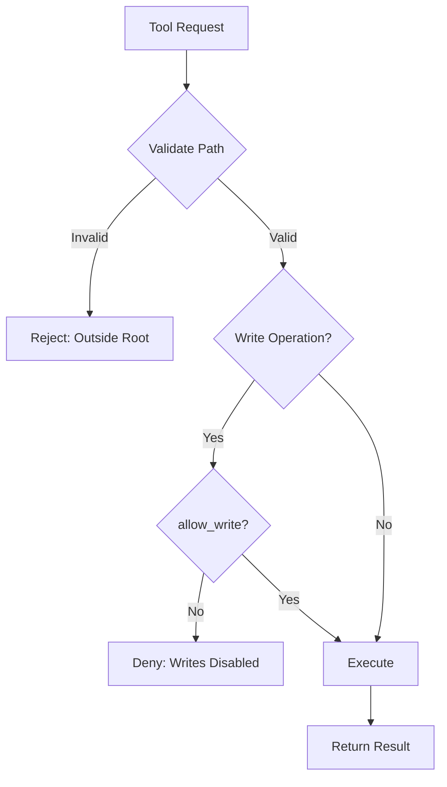

### Tool Registry Pattern

The `ToolRegistry` manages tool registration and lookup:

```rust
// Create registry with all default tools
let mut registry = ToolRegistry::new();

// Register filesystem tools
let fs_config = FileSystemConfig::new(&root).with_write(allow_write);
for tool in create_filesystem_tools_arc(fs_config) {
    registry.register(tool);
}

// Create subset for specific agent
let agent_tools = registry.subset_from_strs(&["read_file", "write_file"]);
```

### Built-in Tools

| Category | Tools | Description |
|----------|-------|-------------|
| **Filesystem** | `read_file`, `write_file`, `list_files`, `search_files` | Sandboxed file operations |
| **Memory** | `memory_store`, `memory_get`, `memory_list`, `memory_delete` | Persistent key-value storage |
| **Web** | `fetch_webpage`, `web_search` | Web content retrieval |
| **Processing** | `process_large_data` | Chunk and summarize large outputs |

### Parallel Execution

Tools are executed concurrently for performance:

```rust
let results = execute_tools_parallel(&registry, tool_calls).await;

// With chunking support for large outputs
let results = execute_tools_parallel_with_chunker(
    &registry,
    tool_calls,
    Some(&chunk_processor),
    Some(original_prompt),
).await;
```

---

## Agent System

### Internal vs External Agents

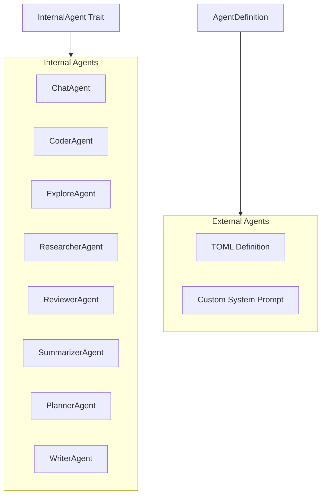

### Agent-as-Tool Pattern

Agents can be invoked as tools, enabling recursive delegation:

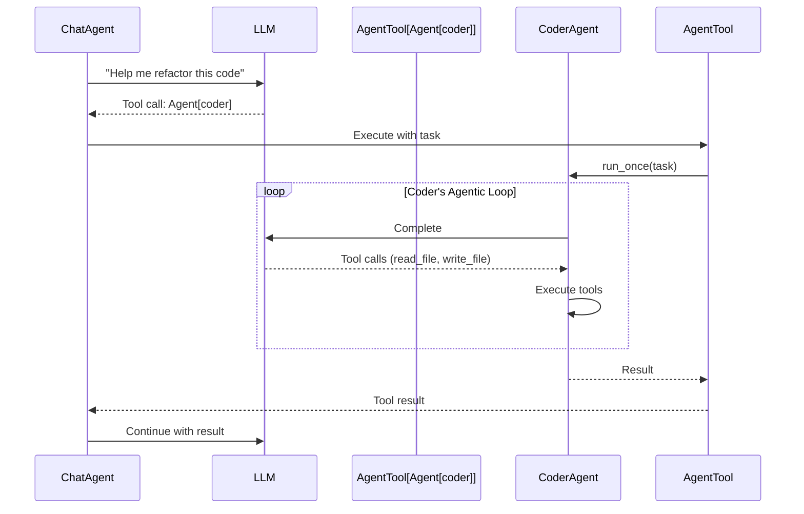

### Agent Depth Limiting

To prevent infinite recursion, agent depth is tracked:

```rust
const DEFAULT_MAX_AGENT_DEPTH: usize = 3;

// Agent tools are created with depth tracking
create_agent_tools(
    &base_tools,
    provider,
    &agents_config,
    current_depth,      // Incremented for each nested agent
    max_agent_depth,    // Stops creating agent tools at max depth
)
```

### Progress Reporting

Agents emit progress events for TUI display:

```rust
pub enum AgentProgressEvent {
    IterationStart { agent_name, iteration, max_iterations },
    ThinkingDelta { agent_name, content },
    ToolStart { agent_name, tool_name },
    ToolComplete { agent_name, tool_name, is_error },
    UsageUpdate { agent_name, usage },
    ByteCount { agent_name, input_bytes, output_bytes },
}
```

---

## TUI Architecture

### Layout System

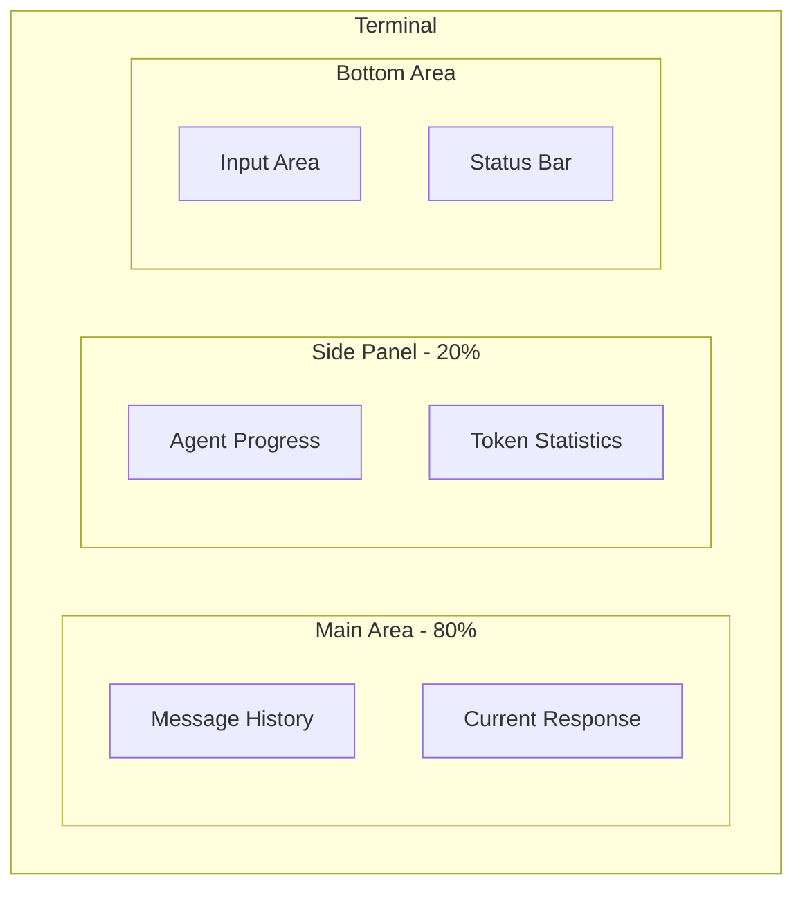

### Component Responsibilities

| Component | Responsibility |
|-----------|----------------|
| **MessageList** | Displays conversation history with markdown rendering |
| **ResponseArea** | Shows streaming response with live updates |
| **AgentPanel** | Displays agent progress, thinking content, tool status |
| **InputArea** | Multi-line input with history |
| **StatusBar** | Shows profile, model, token count |

### Event Handling

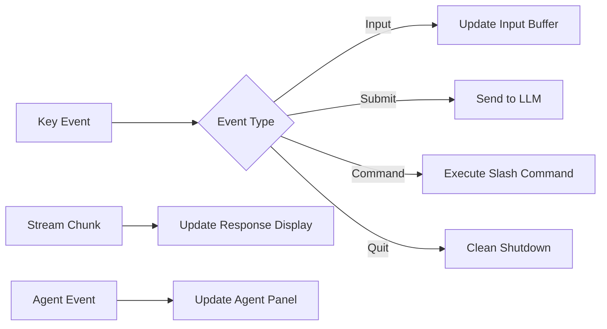

### Real-Time Markdown Rendering

The TUI renders markdown as tokens stream in:

1. Accumulate content in buffer
2. Re-parse markdown on each delta
3. Render with syntax highlighting via `termimad`
4. Handle code blocks with language detection

---

## Extension Points

### Adding New Providers

1. Create a new module in `qq-providers`
2. Implement the `Provider` trait
3. Handle streaming via `StreamResult`

```rust
pub struct MyProvider { /* ... */ }

#[async_trait]
impl Provider for MyProvider {
    fn name(&self) -> &str { "my-provider" }

    async fn complete(&self, request: CompletionRequest)
        -> Result<CompletionResponse, Error> {
        // Implementation
    }

    async fn stream(&self, request: CompletionRequest)
        -> Result<StreamResult, Error> {
        // Return Pin<Box<dyn Stream<Item = Result<StreamChunk>>>>
    }
}
```

### Adding New Tools

1. Create a new module in `qq-tools`
2. Implement the `Tool` trait
3. Define JSON schema parameters

```rust
pub struct MyTool { /* ... */ }

#[async_trait]
impl Tool for MyTool {
    fn name(&self) -> &str { "my_tool" }

    fn description(&self) -> &str { "Does something useful" }

    fn definition(&self) -> ToolDefinition {
        ToolDefinition::new(self.name(), self.description())
            .with_parameters(
                ToolParameters::new()
                    .add_property("input", PropertySchema::string("Input value"), true)
            )
    }

    async fn execute(&self, arguments: Value) -> Result<ToolOutput, Error> {
        let input = arguments["input"].as_str().unwrap_or("");
        Ok(ToolOutput::success(format!("Processed: {}", input)))
    }
}
```

### Adding New Agents

1. Create a new module in `qq-agents`
2. Implement the `InternalAgent` trait
3. Define system prompt and required tools

```rust
pub struct MyAgent;

impl InternalAgent for MyAgent {
    fn name(&self) -> &str { "my-agent" }

    fn description(&self) -> &str { "Custom agent for specific tasks" }

    fn system_prompt(&self) -> &str {
        "You are a specialized agent that..."
    }

    fn tool_names(&self) -> &[&str] {
        &["read_file", "write_file", "my_tool"]
    }

    fn max_iterations(&self) -> usize { 50 }
}
```

---

## Design Decisions

### Why No ncurses?

**Decision**: Use `crossterm` and `ratatui` instead of ncurses.

**Rationale**:
- Pure Rust implementation with no C dependencies
- Cross-platform support (Windows, macOS, Linux) without additional setup
- Better integration with async Rust (crossterm's event-stream feature)
- Simpler build process - no system library requirements

### Why Bundled SQLite?

**Decision**: Use `rusqlite` with the `bundled` feature.

**Rationale**:
- Eliminates runtime dependency on system SQLite
- Ensures consistent SQLite version across platforms
- Simplifies installation - single binary with no external dependencies
- Memory persistence (key-value store) works identically everywhere

### Stateful vs Stateless Agents

**Decision**: Support both modes with clear API separation.

| Mode | Use Case | API |
|------|----------|-----|
| **Stateless** | One-shot tasks, delegated work | `Agent::run_once()` |
| **Stateful** | Interactive conversations, context accumulation | `agent.process()` |

**Rationale**:
- Stateless agents are simpler and avoid context bloat
- Stateful agents needed for interactive chat with history
- Clear separation prevents accidental context leakage between tasks

### Agent-as-Tool vs Direct Invocation

**Decision**: Agents are exposed as tools to the chat agent.

**Rationale**:
- LLM can choose the right agent based on task description
- Consistent interface - all capabilities are tools
- Enables automatic delegation without explicit commands
- Depth limiting prevents infinite recursion

### Streaming by Default

**Decision**: All LLM calls stream by default; non-streaming is opt-in.

**Rationale**:
- Better user experience with visible progress
- Lower perceived latency
- Enables real-time thinking display
- Tool calls are collected during streaming
