# Quick-Query Architecture

A comprehensive technical reference for the Quick-Query (`qq`) Rust workspace. This document covers every crate, type, trait, data flow, and subsystem with annotated Mermaid diagrams.

---

## Table of Contents

1. [Design Philosophy](#design-philosophy)
2. [Workspace Overview](#workspace-overview)
3. [Crate Dependency Graph](#crate-dependency-graph)
4. [Core Type System (qq-core)](#core-type-system-qq-core)
5. [Provider Layer (qq-providers)](#provider-layer-qq-providers)
6. [Tool System (qq-tools)](#tool-system-qq-tools)
7. [Agent Framework (qq-agents)](#agent-framework-qq-agents)
8. [CLI Application (qq-cli)](#cli-application-qq-cli)
9. [Streaming Architecture](#streaming-architecture)
10. [Agent Execution Pipeline](#agent-execution-pipeline)
11. [Memory and Compaction](#memory-and-compaction)
12. [TUI Rendering Pipeline](#tui-rendering-pipeline)
13. [Configuration Resolution](#configuration-resolution)
14. [Error Handling](#error-handling)
15. [Extension Points](#extension-points)
16. [Design Decisions](#design-decisions)

---

## Design Philosophy

Quick-Query is built on several core principles:

| Principle | Implementation |
|-----------|----------------|
| **Pure Rust** | No ncurses dependency; terminal handling via crossterm/ratatui |
| **Streaming-First** | All LLM interactions support streaming by default |
| **Parallel Execution** | Tools execute concurrently; multiple agent calls can run in parallel |
| **Multi-Provider** | Native OpenAI, Anthropic, Gemini + any OpenAI-compatible API |
| **Security by Default** | Filesystem sandboxing, write-disabled by default, no credential storage |

---

## Workspace Overview

Quick-Query is organized as a Cargo workspace with five crates. Each crate has a single responsibility and communicates through the shared abstractions defined in `qq-core`.

```
quick-query-rs/
├── crates/
│   ├── qq-core/        # Traits, types, infrastructure (no implementations)
│   ├── qq-providers/   # LLM API implementations (OpenAI, Anthropic, Gemini)
│   ├── qq-tools/       # Built-in tool implementations (filesystem, memory, web, tasks)
│   ├── qq-agents/      # Agent definitions, prompts, and behaviors
│   └── qq-cli/         # Binary: CLI, TUI, chat session, event bus
├── examples/
└── docs/
```

---

## Crate Dependency Graph

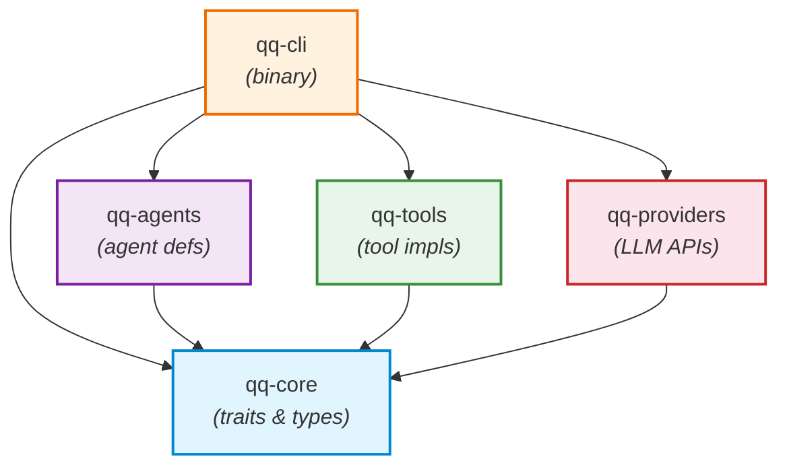
```mermaid
graph TD
    CLI["qq-cli<br/><i>(binary)</i>"]
    AGENTS["qq-agents<br/><i>(agent defs)</i>"]
    TOOLS["qq-tools<br/><i>(tool impls)</i>"]
    PROVIDERS["qq-providers<br/><i>(LLM APIs)</i>"]
    CORE["qq-core<br/><i>(traits & types)</i>"]

    CLI --> AGENTS
    CLI --> TOOLS
    CLI --> PROVIDERS
    CLI --> CORE
    AGENTS --> CORE
    TOOLS --> CORE
    PROVIDERS --> CORE

    style CORE fill:#e1f5fe,stroke:#0288d1,stroke-width:2px
    style CLI fill:#fff3e0,stroke:#ef6c00,stroke-width:2px
    style AGENTS fill:#f3e5f5,stroke:#7b1fa2,stroke-width:2px
    style TOOLS fill:#e8f5e9,stroke:#388e3c,stroke-width:2px
    style PROVIDERS fill:#fce4ec,stroke:#c62828,stroke-width:2px
```

### Crate Responsibilities

| Crate | Purpose | Key Exports |
|-------|---------|-------------|
| **qq-core** | Foundation types and traits | `Provider`, `Tool`, `Agent`, `Message`, `ToolRegistry`, `AgentMemory` |
| **qq-providers** | LLM provider implementations | `OpenAIProvider`, `AnthropicProvider`, `GeminiProvider` |
| **qq-tools** | Built-in tools for agents | `create_filesystem_tools`, `create_memory_tools`, `create_web_tools`, `create_task_tools`, `TaskStore` |
| **qq-agents** | Agent definitions | `ProjectManagerAgent`, `CoderAgent`, `ExploreAgent`, etc. |
| **qq-cli** | User-facing CLI binary | `qq` binary, TUI, configuration loading, event bus |

**Key constraint:** `qq-core` has zero knowledge of the other crates. `qq-agents`, `qq-tools`, and `qq-providers` depend only on `qq-core`. Only `qq-cli` depends on all four, wiring them together at startup.

---

## Core Type System (qq-core)

`qq-core` defines every trait and type that the rest of the system uses. It contains no implementations of providers, tools, or agents.

### Module Map

| Module | Key Exports |
|--------|-------------|
| `message` | `Message`, `Role`, `Content`, `ContentPart`, `ToolCall`, `ToolResult`, `StreamChunk`, `Usage` |
| `provider` | `Provider` trait, `CompletionRequest`, `CompletionResponse`, `FinishReason`, `StreamResult` |
| `tool` | `Tool` trait, `ToolRegistry`, `ToolDefinition`, `ToolParameters`, `PropertySchema`, `ToolOutput` |
| `agent` | `Agent`, `AgentConfig`, `AgentMemory`, `AgentInstanceState`, `AgentRunResult`, `AgentProgressEvent`, `AgentProgressHandler`, `AgentChannel`, `AgentRegistry` |
| `task` | `TaskManager`, `TaskHandle`, `execute_tools_parallel`, `complete_parallel` |
| `chunker` | `ChunkProcessor`, `ChunkerConfig` |
| `error` | `Error` enum (13 variants) |

### Message Model

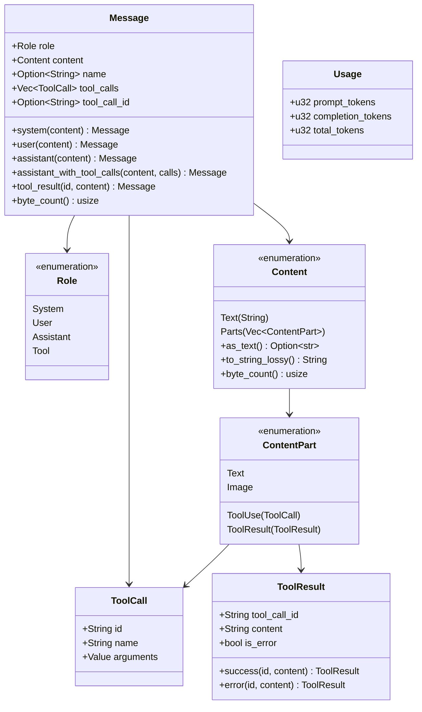
```mermaid
classDiagram
    class Message {
        +Role role
        +Content content
        +Option~String~ name
        +Vec~ToolCall~ tool_calls
        +Option~String~ tool_call_id
        +system(content) Message
        +user(content) Message
        +assistant(content) Message
        +assistant_with_tool_calls(content, calls) Message
        +tool_result(id, content) Message
        +byte_count() usize
    }

    class Role {
        <<enumeration>>
        System
        User
        Assistant
        Tool
    }

    class Content {
        <<enumeration>>
        Text(String)
        Parts(Vec~ContentPart~)
        +as_text() Option~str~
        +to_string_lossy() String
        +byte_count() usize
    }

    class ContentPart {
        <<enumeration>>
        Text
        Image
        ToolUse(ToolCall)
        ToolResult(ToolResult)
    }

    class ToolCall {
        +String id
        +String name
        +Value arguments
    }

    class ToolResult {
        +String tool_call_id
        +String content
        +bool is_error
        +success(id, content) ToolResult
        +error(id, content) ToolResult
    }

    class Usage {
        +u32 prompt_tokens
        +u32 completion_tokens
        +u32 total_tokens
    }

    Message --> Role
    Message --> Content
    Message --> ToolCall
    Content --> ContentPart
    ContentPart --> ToolCall
    ContentPart --> ToolResult
```

Messages flow through the system in `Vec<Message>` sequences. The `byte_count()` method on `Message` and `Content` enables memory budgeting throughout the compaction and agent memory systems.

### Provider Trait

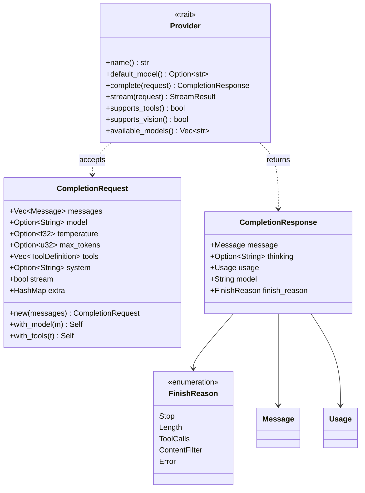
```mermaid
classDiagram
    class Provider {
        <<trait>>
        +name() str
        +default_model() Option~str~
        +complete(request) CompletionResponse
        +stream(request) StreamResult
        +supports_tools() bool
        +supports_vision() bool
        +available_models() Vec~str~
    }

    class CompletionRequest {
        +Vec~Message~ messages
        +Option~String~ model
        +Option~f32~ temperature
        +Option~u32~ max_tokens
        +Vec~ToolDefinition~ tools
        +Option~String~ system
        +bool stream
        +HashMap extra
        +new(messages) CompletionRequest
        +with_model(m) Self
        +with_tools(t) Self
    }

    class CompletionResponse {
        +Message message
        +Option~String~ thinking
        +Usage usage
        +String model
        +FinishReason finish_reason
    }

    class FinishReason {
        <<enumeration>>
        Stop
        Length
        ToolCalls
        ContentFilter
        Error
    }

    Provider ..> CompletionRequest : accepts
    Provider ..> CompletionResponse : returns
    CompletionResponse --> FinishReason
    CompletionResponse --> Message
    CompletionResponse --> Usage
```

`StreamResult` is `Pin<Box<dyn Stream<Item = Result<StreamChunk, Error>> + Send>>` -- a pinned async stream of `StreamChunk` variants.

### StreamChunk

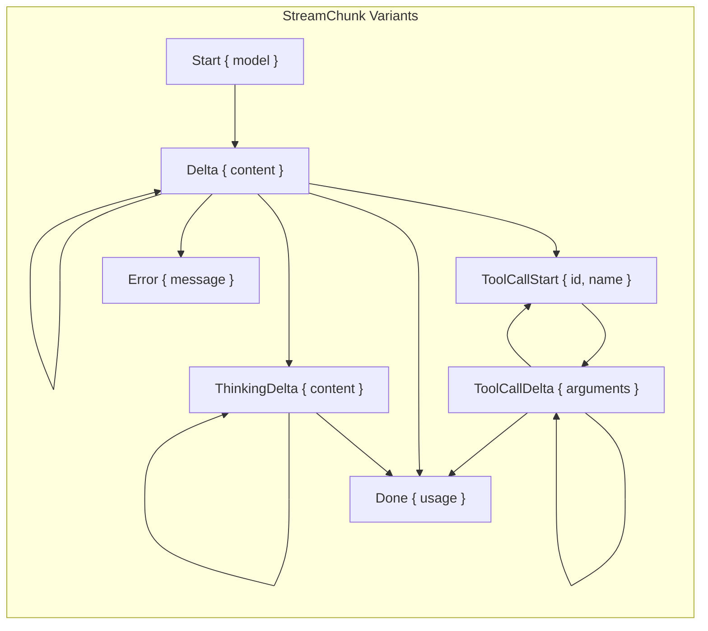
```mermaid
graph LR
    subgraph StreamChunk Variants
        Start["Start { model }"]
        Delta["Delta { content }"]
        Think["ThinkingDelta { content }"]
        TCS["ToolCallStart { id, name }"]
        TCD["ToolCallDelta { arguments }"]
        Done["Done { usage }"]
        Err["Error { message }"]
    end

    Start --> Delta
    Delta --> Delta
    Delta --> Think
    Think --> Think
    Delta --> TCS
    TCS --> TCD
    TCD --> TCD
    TCD --> TCS
    TCD --> Done
    Delta --> Done
    Think --> Done
    Delta --> Err
```

### Tool Trait and Registry

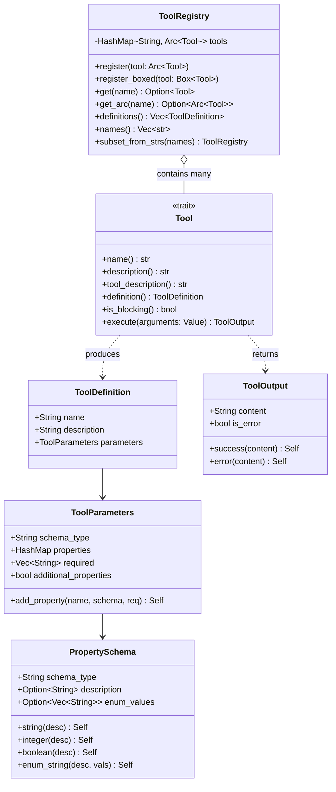
```mermaid
classDiagram
    class Tool {
        <<trait>>
        +name() str
        +description() str
        +tool_description() str
        +definition() ToolDefinition
        +is_blocking() bool
        +execute(arguments: Value) ToolOutput
    }

    class ToolRegistry {
        -HashMap~String, Arc~Tool~~ tools
        +register(tool: Arc~Tool~)
        +register_boxed(tool: Box~Tool~)
        +get(name) Option~Tool~
        +get_arc(name) Option~Arc~Tool~~
        +definitions() Vec~ToolDefinition~
        +names() Vec~str~
        +subset_from_strs(names) ToolRegistry
    }

    class ToolDefinition {
        +String name
        +String description
        +ToolParameters parameters
    }

    class ToolParameters {
        +String schema_type
        +HashMap properties
        +Vec~String~ required
        +bool additional_properties
        +add_property(name, schema, req) Self
    }

    class PropertySchema {
        +String schema_type
        +Option~String~ description
        +Option~Vec~String~~ enum_values
        +string(desc) Self
        +integer(desc) Self
        +boolean(desc) Self
        +enum_string(desc, vals) Self
    }

    class ToolOutput {
        +String content
        +bool is_error
        +success(content) Self
        +error(content) Self
    }

    ToolRegistry o-- Tool : contains many
    Tool ..> ToolDefinition : produces
    Tool ..> ToolOutput : returns
    ToolDefinition --> ToolParameters
    ToolParameters --> PropertySchema
```

`ToolRegistry::subset_from_strs()` creates a new registry containing only the named tools. This is how agents get restricted tool access.

### Agent Framework

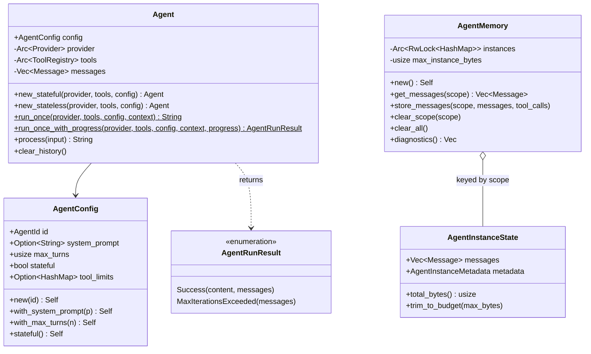
```mermaid
classDiagram
    class Agent {
        +AgentConfig config
        -Arc~Provider~ provider
        -Arc~ToolRegistry~ tools
        -Vec~Message~ messages
        +new_stateful(provider, tools, config) Agent
        +new_stateless(provider, tools, config) Agent
        +run_once(provider, tools, config, context) String$
        +run_once_with_progress(provider, tools, config, context, progress) AgentRunResult$
        +process(input) String
        +clear_history()
    }

    class AgentConfig {
        +AgentId id
        +Option~String~ system_prompt
        +usize max_turns
        +bool stateful
        +Option~HashMap~ tool_limits
        +new(id) Self
        +with_system_prompt(p) Self
        +with_max_turns(n) Self
        +stateful() Self
    }

    class AgentRunResult {
        <<enumeration>>
        Success(content, messages)
        MaxIterationsExceeded(messages)
    }

    class AgentMemory {
        -Arc~RwLock~HashMap~~ instances
        -usize max_instance_bytes
        +new() Self
        +get_messages(scope) Vec~Message~
        +store_messages(scope, messages, tool_calls)
        +clear_scope(scope)
        +clear_all()
        +diagnostics() Vec
    }

    class AgentInstanceState {
        +Vec~Message~ messages
        +AgentInstanceMetadata metadata
        +total_bytes() usize
        +trim_to_budget(max_bytes)
    }

    Agent --> AgentConfig
    Agent ..> AgentRunResult : returns
    AgentMemory o-- AgentInstanceState : keyed by scope
```

**Constants:**
- `DEFAULT_MAX_INSTANCE_BYTES`: 200,000 bytes per agent scope
- `STREAM_CHUNK_TIMEOUT`: 120 seconds
- `MAX_STREAM_RETRIES`: 3
- `MAX_AGENT_TOOL_RESULT_BYTES`: 50,000 bytes (truncation threshold)

### Parallel Execution

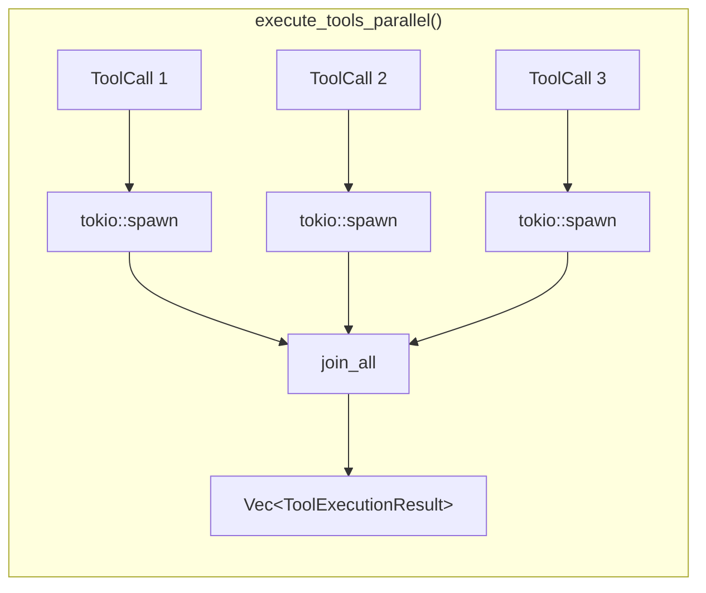
```mermaid
graph LR
    subgraph "execute_tools_parallel()"
        TC1[ToolCall 1] --> S1[tokio::spawn]
        TC2[ToolCall 2] --> S2[tokio::spawn]
        TC3[ToolCall 3] --> S3[tokio::spawn]
        S1 --> J[join_all]
        S2 --> J
        S3 --> J
        J --> R["Vec&lt;ToolExecutionResult&gt;"]
    end
```

`execute_tools_parallel_with_chunker` wraps `execute_tools_parallel` and passes large outputs (exceeding `ChunkerConfig::threshold_bytes`) through `ChunkProcessor` for LLM-based summarization.

---

## Provider Layer (qq-providers)

Three native provider implementations, plus OpenAI-compatible support for any third-party API.

### Provider Dispatch

Provider type is resolved from config in this priority order:
1. Explicit `type` field in provider config (always wins)
2. If no `type` but `base_url` is set → `"openai"` (OpenAI-compatible mode)
3. If no `type` and no `base_url` → infer from provider name (`"anthropic"`/`"claude"` → anthropic, `"gemini"`/`"google"` → gemini, else → openai)

### Provider Implementations

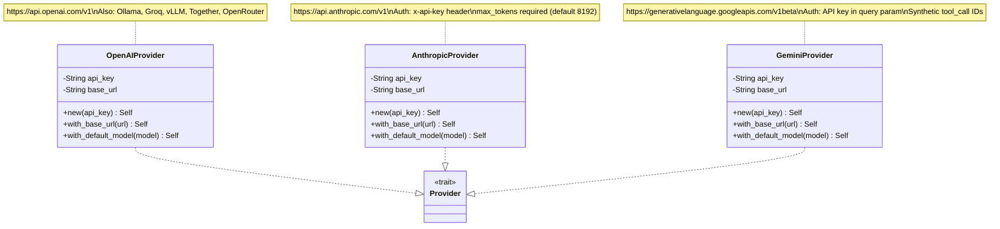
```mermaid
classDiagram
    class Provider {
        <<trait>>
    }

    class OpenAIProvider {
        -String api_key
        -String base_url
        +new(api_key) Self
        +with_base_url(url) Self
        +with_default_model(model) Self
    }

    class AnthropicProvider {
        -String api_key
        -String base_url
        +new(api_key) Self
        +with_base_url(url) Self
        +with_default_model(model) Self
    }

    class GeminiProvider {
        -String api_key
        -String base_url
        +new(api_key) Self
        +with_base_url(url) Self
        +with_default_model(model) Self
    }

    OpenAIProvider ..|> Provider
    AnthropicProvider ..|> Provider
    GeminiProvider ..|> Provider

    note for OpenAIProvider "https://api.openai.com/v1\nAlso: Ollama, Groq, vLLM, Together, OpenRouter"
    note for AnthropicProvider "https://api.anthropic.com/v1\nAuth: x-api-key header\nmax_tokens required (default 8192)"
    note for GeminiProvider "https://generativelanguage.googleapis.com/v1beta\nAuth: API key in query param\nSynthetic tool_call IDs"
```

### Key API Differences

| Aspect | OpenAI | Anthropic | Gemini |
|--------|--------|-----------|--------|
| **Auth** | `Authorization: Bearer` | `x-api-key` header | `?key=` query param |
| **System prompt** | System role message | Separate `system` field | `system_instruction` field |
| **Assistant role** | `"assistant"` | `"assistant"` | `"model"` |
| **Tool results** | Tool role message | User role `tool_result` block | User role `functionResponse` |
| **Tool call IDs** | Server-generated | Server-generated | Synthetic (`gemini_tc_N`) |
| **Thinking** | `reasoning_content` field | Native `thinking` blocks | Content tag extraction |
| **max_tokens** | Optional | Required (default 8192) | Optional (`max_output_tokens`) |

**Streaming internals:** All three providers use SSE for streaming. OpenAI and Gemini parse `data:` payloads directly. Anthropic uses typed event names (`content_block_start`, `content_block_delta`, etc.). Tool calls are assembled incrementally via `ToolCallStart`/`ToolCallDelta` chunks.

**Thinking extraction:** OpenAI uses `reasoning_content` fields. Anthropic has native `thinking` content blocks. All providers fall back to `<think>...</think>` / `<reasoning>...</reasoning>` tag extraction from content.

**Message alternation:** Anthropic requires strict user/assistant alternation. Adjacent same-role messages (e.g., multiple tool results) are automatically merged into a single message with combined content blocks.

---

## Tool System (qq-tools)

### Tool Categories

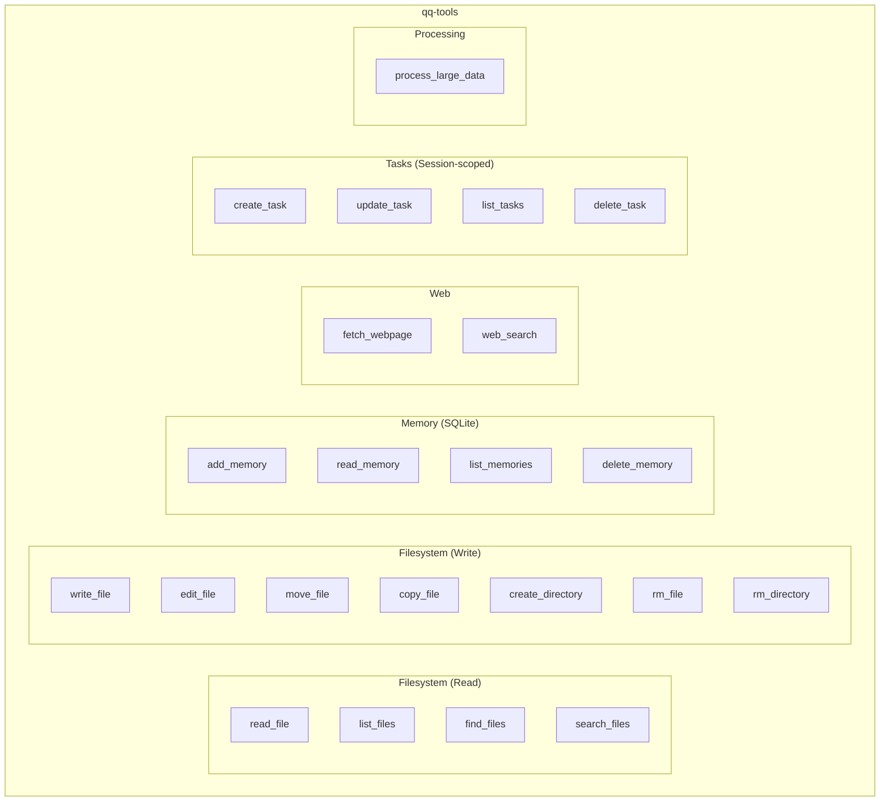
```mermaid
graph TD
    subgraph "qq-tools"
        subgraph "Filesystem (Read)"
            RF[read_file]
            LF[list_files]
            FF[find_files]
            SF[search_files]
        end

        subgraph "Filesystem (Write)"
            WF[write_file]
            EF[edit_file]
            MF[move_file]
            CF[copy_file]
            CD[create_directory]
            RMF[rm_file]
            RMD[rm_directory]
        end

        subgraph "Memory (SQLite)"
            AM[add_memory]
            RM[read_memory]
            LM[list_memories]
            DM[delete_memory]
        end

        subgraph "Web"
            FW[fetch_webpage]
            WS[web_search]
        end

        subgraph "Tasks (Session-scoped)"
            CT[create_task]
            UT[update_task]
            LT[list_tasks]
            DT[delete_task]
        end

        subgraph "Processing"
            PLD[process_large_data]
        end
    end
```

### Security Model

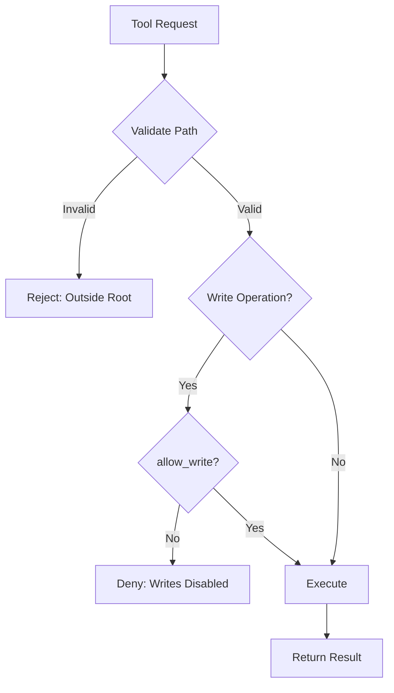
```mermaid
flowchart TD
    Request[Tool Request] --> Validate{Validate Path}
    Validate -->|Invalid| Reject[Reject: Outside Root]
    Validate -->|Valid| CheckWrite{Write Operation?}
    CheckWrite -->|Yes| CheckAllow{allow_write?}
    CheckAllow -->|No| Deny[Deny: Writes Disabled]
    CheckAllow -->|Yes| Execute[Execute]
    CheckWrite -->|No| Execute
    Execute --> Return[Return Result]
```

### Shared Store Pattern

Both `MemoryStore` and `TaskStore` use the same pattern: a shared inner state behind a synchronization primitive, with multiple tool structs holding `Arc` references to the store.

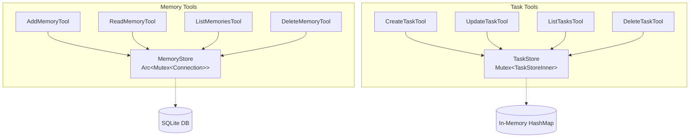
```mermaid
graph TD
    subgraph "Memory Tools"
        MS["MemoryStore<br/>Arc&lt;Mutex&lt;Connection&gt;&gt;"]
        AMT["AddMemoryTool"] --> MS
        RMT["ReadMemoryTool"] --> MS
        LMT["ListMemoriesTool"] --> MS
        DMT["DeleteMemoryTool"] --> MS
    end

    subgraph "Task Tools"
        TS["TaskStore<br/>Mutex&lt;TaskStoreInner&gt;"]
        CTT["CreateTaskTool"] --> TS
        UTT["UpdateTaskTool"] --> TS
        LTT["ListTasksTool"] --> TS
        DTT["DeleteTaskTool"] --> TS
    end

    MS -.-> SQLite[(SQLite DB)]
    TS -.-> RAM[(In-Memory HashMap)]
```

**MemoryStore** persists across sessions via SQLite. **TaskStore** is session-scoped (in-memory `HashMap<String, Task>` with incrementing IDs).

### Task Model

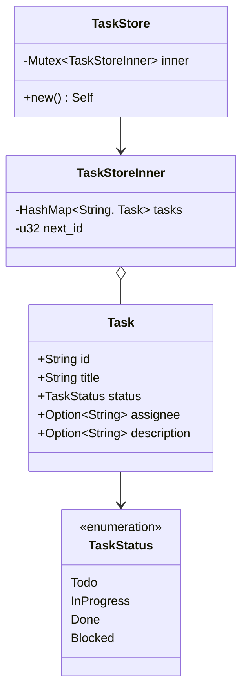
```mermaid
classDiagram
    class TaskStore {
        -Mutex~TaskStoreInner~ inner
        +new() Self
    }

    class TaskStoreInner {
        -HashMap~String, Task~ tasks
        -u32 next_id
    }

    class Task {
        +String id
        +String title
        +TaskStatus status
        +Option~String~ assignee
        +Option~String~ description
    }

    class TaskStatus {
        <<enumeration>>
        Todo
        InProgress
        Done
        Blocked
    }

    TaskStore --> TaskStoreInner
    TaskStoreInner o-- Task
    Task --> TaskStatus
```

### Built-in Tools

| Category | Tools | Description |
|----------|-------|-------------|
| **Filesystem (read)** | `read_file`, `list_files`, `find_files`, `search_files` | Sandboxed read operations |
| **Filesystem (write)** | `write_file`, `edit_file`, `move_file`, `copy_file`, `create_directory`, `rm_file`, `rm_directory` | Write operations (require `allow_write`) |
| **Memory** | `add_memory`, `read_memory`, `list_memories`, `delete_memory` | Persistent SQLite-backed key-value storage |
| **Web** | `fetch_webpage`, `web_search` | Web content retrieval (optional Perplexica search) |
| **Tasks** | `create_task`, `update_task`, `list_tasks`, `delete_task` | Session-scoped task tracking for the PM agent |
| **Processing** | `process_large_data` | Chunk and summarize large outputs |

### Tool Registry Construction

The `build_tools_registry` function in `qq-cli` assembles tools based on config:

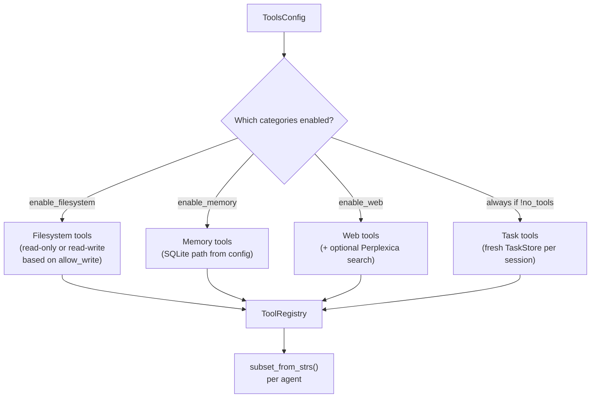
```mermaid
flowchart TD
    Config[ToolsConfig] --> Check{Which categories enabled?}
    Check -->|enable_filesystem| FS["Filesystem tools<br/>(read-only or read-write<br/>based on allow_write)"]
    Check -->|enable_memory| MEM["Memory tools<br/>(SQLite path from config)"]
    Check -->|enable_web| WEB["Web tools<br/>(+ optional Perplexica search)"]
    Check -->|always if !no_tools| TASK["Task tools<br/>(fresh TaskStore per session)"]

    FS --> REG[ToolRegistry]
    MEM --> REG
    WEB --> REG
    TASK --> REG

    REG --> SUBSET["subset_from_strs()<br/>per agent"]
```

---

## Agent Framework (qq-agents)

### Agent Type Hierarchy


```mermaid
classDiagram
    class InternalAgent {
        <<trait>>
        +name() str
        +description() str
        +system_prompt() str
        +tool_names() [str]
        +max_turns() usize
        +tool_description() str
        +tool_limits() Option~HashMap~
        +compact_prompt() str
    }

    class ProjectManagerAgent {
        -Option~String~ custom_prompt
        -bool agents_only
        +name() "pm"
        +max_turns() 100
        +tool_names() [create_task, update_task, list_tasks, delete_task]
    }

    class ExploreAgent {
        +name() "explore"
        +max_turns() 20
        +tool_names() [read_file, find_files, search_files]
    }

    class ResearcherAgent {
        +name() "researcher"
        +max_turns() 20
        +tool_names() [web_search, fetch_webpage, read_memory]
    }

    class CoderAgent {
        +name() "coder"
        +max_turns() 50
        +tool_names() [read_file, edit_file, write_file, ...]
    }

    class ReviewerAgent {
        +name() "reviewer"
        +max_turns() 20
        +tool_names() [read_file, find_files, search_files]
    }

    class SummarizerAgent {
        +name() "summarizer"
        +max_turns() 5
        +tool_names() []
    }

    class PlannerAgent {
        +name() "planner"
        +max_turns() 20
        +tool_names() [read_memory]
    }

    class WriterAgent {
        +name() "writer"
        +max_turns() 50
        +tool_names() [read_file, write_file, edit_file, ...]
    }

    InternalAgent <|.. ProjectManagerAgent
    InternalAgent <|.. ExploreAgent
    InternalAgent <|.. ResearcherAgent
    InternalAgent <|.. CoderAgent
    InternalAgent <|.. ReviewerAgent
    InternalAgent <|.. SummarizerAgent
    InternalAgent <|.. PlannerAgent
    InternalAgent <|.. WriterAgent
```

### InternalAgentType Enum

```rust
enum InternalAgentType {
    ProjectManager, Researcher, Summarizer, Coder,
    Reviewer, Explore, Planner, Writer,
}
```

- `all()` returns all variants **except** `ProjectManager` (sub-agents only).
- `all_with_pm()` includes `ProjectManager`.
- `from_name("chat")` maps to `ProjectManager` for backward compatibility.

### Agent-as-Tool Pattern

Agents are wrapped as `Tool` implementations so the PM (or any parent agent) can invoke them via the standard tool-calling protocol.

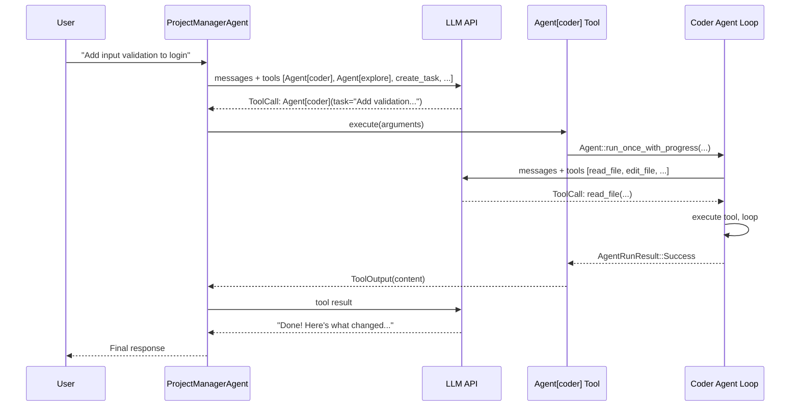
```mermaid
sequenceDiagram
    participant User
    participant PM as ProjectManagerAgent
    participant LLM as LLM API
    participant CoderTool as Agent[coder] Tool
    participant CoderAgent as Coder Agent Loop

    User->>PM: "Add input validation to login"
    PM->>LLM: messages + tools [Agent[coder], Agent[explore], create_task, ...]
    LLM-->>PM: ToolCall: Agent[coder](task="Add validation...")
    PM->>CoderTool: execute(arguments)
    CoderTool->>CoderAgent: Agent::run_once_with_progress(...)
    CoderAgent->>LLM: messages + tools [read_file, edit_file, ...]
    LLM-->>CoderAgent: ToolCall: read_file(...)
    CoderAgent->>CoderAgent: execute tool, loop
    CoderAgent-->>CoderTool: AgentRunResult::Success
    CoderTool-->>PM: ToolOutput(content)
    PM->>LLM: tool result
    LLM-->>PM: "Done! Here's what changed..."
    PM-->>User: Final response
```

### Agent Tool Construction

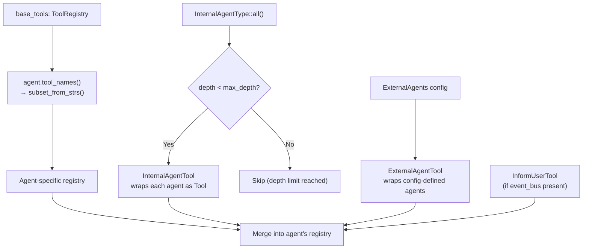
```mermaid
flowchart TD
    BASE[base_tools: ToolRegistry] --> SUBSET["agent.tool_names()<br/>→ subset_from_strs()"]
    SUBSET --> ATOOL["Agent-specific registry"]

    ALL_AGENTS["InternalAgentType::all()"] --> FILTER{depth < max_depth?}
    FILTER -->|Yes| WRAP["InternalAgentTool<br/>wraps each agent as Tool"]
    FILTER -->|No| SKIP["Skip (depth limit reached)"]

    WRAP --> MERGE["Merge into agent's registry"]
    ATOOL --> MERGE

    EXT["ExternalAgents config"] --> EWRAP["ExternalAgentTool<br/>wraps config-defined agents"]
    EWRAP --> MERGE

    IU["InformUserTool<br/>(if event_bus present)"] --> MERGE
```

**Constants:**
- `DEFAULT_MAX_AGENT_DEPTH`: 5
- Each nesting level increments `current_depth`
- At `current_depth >= max_depth`, no agent tools are added (prevents infinite recursion)

### Preamble System

Each agent's system prompt is prefixed with a dynamically generated preamble from `generate_preamble(PreambleContext)`:

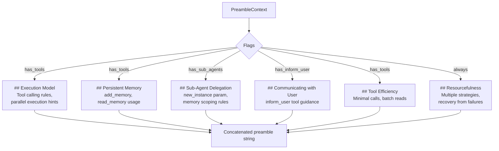
```mermaid
flowchart TD
    CTX["PreambleContext"] --> CHECK{Flags}

    CHECK -->|has_tools| SEC1["## Execution Model\nTool calling rules,\nparallel execution hints"]
    CHECK -->|has_tools| SEC2["## Persistent Memory\nadd_memory, read_memory usage"]
    CHECK -->|has_sub_agents| SEC3["## Sub-Agent Delegation\nnew_instance param,\nmemory scoping rules"]
    CHECK -->|has_inform_user| SEC4["## Communicating with User\ninform_user tool guidance"]
    CHECK -->|has_tools| SEC5["## Tool Efficiency\nMinimal calls, batch reads"]
    CHECK -->|always| SEC6["## Resourcefulness\nMultiple strategies,\nrecovery from failures"]

    SEC1 --> PREAMBLE["Concatenated preamble string"]
    SEC2 --> PREAMBLE
    SEC3 --> PREAMBLE
    SEC4 --> PREAMBLE
    SEC5 --> PREAMBLE
    SEC6 --> PREAMBLE
```

The PM gets `has_tools: true`, `has_sub_agents: true`, `has_inform_user: true`. A pure-LLM agent like `summarizer` gets all `false`.

---

## CLI Application (qq-cli)

### Module Map

```
qq-cli/src/
├── main.rs              # Entry point, CLI parsing, mode dispatch
├── chat.rs              # ChatSession (conversation state + compaction)
├── config.rs            # TOML config loading, profile resolution
├── markdown.rs          # Streaming markdown renderer
├── debug_log.rs         # JSON-lines debug logging
├── event_bus.rs         # AgentEventBus (broadcast channel)
├── execution_context.rs # Call stack tracking
├── agents/
│   ├── mod.rs           # AgentExecutor
│   ├── agent_tool.rs    # InternalAgentTool, ExternalAgentTool, create_agent_tools
│   ├── continuation.rs  # execute_with_continuation, ExecutionSummary
│   └── inform_user.rs   # InformUserTool
└── tui/
    ├── mod.rs
    ├── app.rs           # TuiApp state, event loop
    ├── ui.rs            # Frame rendering
    ├── layout.rs        # Pane calculations
    ├── scroll.rs        # ScrollState
    ├── markdown.rs      # TUI markdown renderer
    ├── events.rs        # Event processing
    └── widgets/
        ├── mod.rs
        └── status_bar.rs
```

### Startup Flow

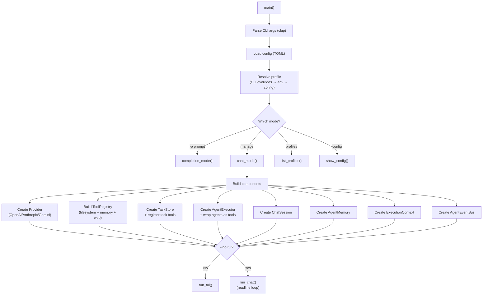
```mermaid
flowchart TD
    MAIN["main()"] --> PARSE["Parse CLI args (clap)"]
    PARSE --> LOAD["Load config (TOML)"]
    LOAD --> RESOLVE["Resolve profile<br/>(CLI overrides → env → config)"]
    RESOLVE --> MODE{Which mode?}

    MODE -->|"-p prompt"| COMP["completion_mode()"]
    MODE -->|"manage"| CHAT["chat_mode()"]
    MODE -->|"profiles"| PROF["list_profiles()"]
    MODE -->|"config"| CONF["show_config()"]

    CHAT --> BUILD["Build components"]
    BUILD --> PROV["Create Provider<br/>(OpenAI/Anthropic/Gemini)"]
    BUILD --> TOOLS["Build ToolRegistry<br/>(filesystem + memory + web)"]
    BUILD --> TASKS["Create TaskStore<br/>+ register task tools"]
    BUILD --> AGENTS["Create AgentExecutor<br/>+ wrap agents as tools"]
    BUILD --> SESSION["Create ChatSession"]
    BUILD --> MEMORY["Create AgentMemory"]
    BUILD --> ECTX["Create ExecutionContext"]
    BUILD --> EBUS["Create AgentEventBus"]

    PROV --> TUI_CHECK{--no-tui?}
    TOOLS --> TUI_CHECK
    TASKS --> TUI_CHECK
    AGENTS --> TUI_CHECK
    SESSION --> TUI_CHECK
    MEMORY --> TUI_CHECK
    ECTX --> TUI_CHECK
    EBUS --> TUI_CHECK

    TUI_CHECK -->|No| TUI["run_tui()"]
    TUI_CHECK -->|Yes| READLINE["run_chat()<br/>(readline loop)"]
```

### Chat Mode Wiring

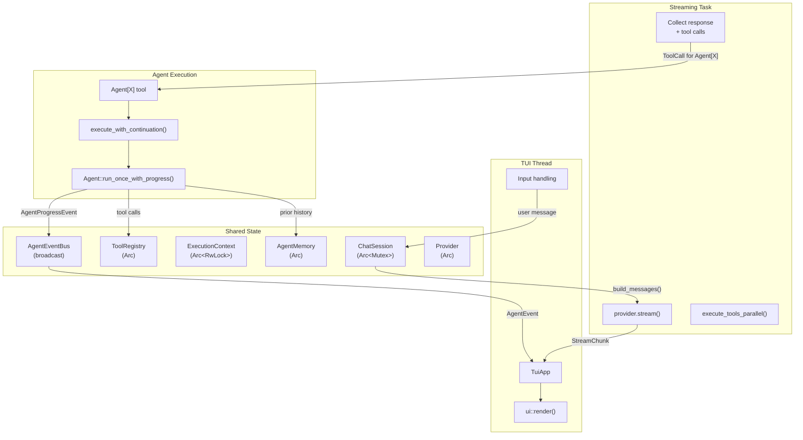
```mermaid
graph TD
    subgraph "Shared State"
        SESSION["ChatSession<br/>(Arc&lt;Mutex&gt;)"]
        MEMORY["AgentMemory<br/>(Arc)"]
        ECTX["ExecutionContext<br/>(Arc&lt;RwLock&gt;)"]
        EBUS["AgentEventBus<br/>(broadcast)"]
        TOOLS["ToolRegistry<br/>(Arc)"]
        PROVIDER["Provider<br/>(Arc)"]
    end

    subgraph "TUI Thread"
        APP["TuiApp"]
        RENDER["ui::render()"]
        INPUT["Input handling"]
    end

    subgraph "Streaming Task"
        STREAM["provider.stream()"]
        COLLECT["Collect response<br/>+ tool calls"]
        EXEC["execute_tools_parallel()"]
    end

    subgraph "Agent Execution"
        ATOOL["Agent[X] tool"]
        CONT["execute_with_continuation()"]
        INNER["Agent::run_once_with_progress()"]
    end

    INPUT -->|"user message"| SESSION
    SESSION -->|"build_messages()"| STREAM
    STREAM -->|"StreamChunk"| APP
    EBUS -->|"AgentEvent"| APP
    APP --> RENDER

    COLLECT -->|"ToolCall for Agent[X]"| ATOOL
    ATOOL --> CONT
    CONT --> INNER
    INNER -->|"AgentProgressEvent"| EBUS
    INNER -->|"tool calls"| TOOLS
    INNER -->|"prior history"| MEMORY
```

### Completion Mode

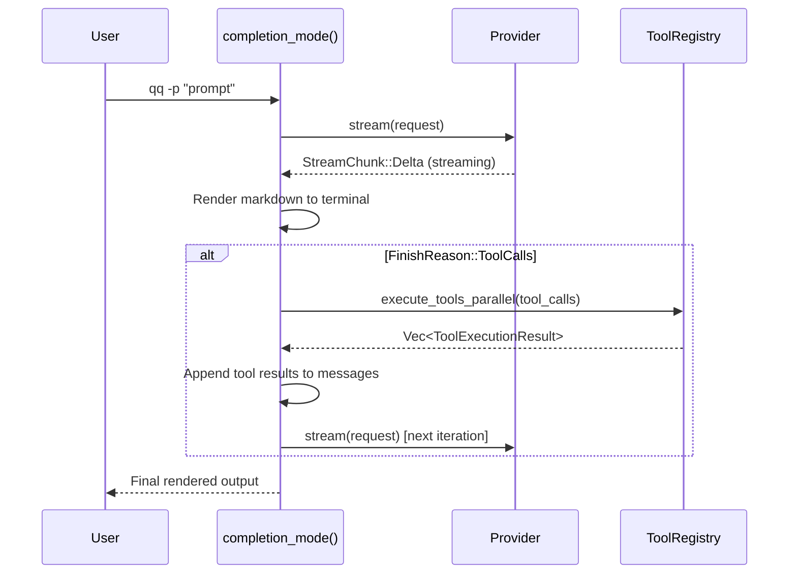
```mermaid
sequenceDiagram
    participant User
    participant CLI as completion_mode()
    participant Provider
    participant Tools as ToolRegistry

    User->>CLI: qq -p "prompt"
    CLI->>Provider: stream(request)
    Provider-->>CLI: StreamChunk::Delta (streaming)
    CLI->>CLI: Render markdown to terminal

    alt FinishReason::ToolCalls
        CLI->>Tools: execute_tools_parallel(tool_calls)
        Tools-->>CLI: Vec<ToolExecutionResult>
        CLI->>CLI: Append tool results to messages
        CLI->>Provider: stream(request) [next iteration]
    end

    CLI-->>User: Final rendered output
```

### Execution Context

The `ExecutionContext` tracks the current call stack for TUI display:

```mermaid
classDiagram
    class ExecutionContext {
        -Arc~RwLock~Vec~ContextEntry~~~ stack
        +push_agent(name)
        +push_tool(name)
        +pop()
        +reset()
        +format() String
    }

    class ContextEntry {
        +ContextType context_type
        +String name
    }

    class ContextType {
        <<enumeration>>
        Chat
        Agent
        Tool
    }

    ExecutionContext o-- ContextEntry
    ContextEntry --> ContextType
```

Example stack: `Chat > Agent[pm] > Agent[coder] > Tool[edit_file]`

---

## Streaming Architecture

### Stream Processing Pipeline

```mermaid
flowchart LR
    subgraph Provider
        API["OpenAI API<br/>SSE endpoint"]
    end

    subgraph "Stream Processing"
        PARSE["Parse SSE lines"]
        ASSEMBLE["Assemble tool calls<br/>from deltas"]
        THINK["Extract thinking<br/>content"]
    end

    subgraph "Output Targets"
        TUI["TuiApp<br/>(content buffer)"]
        MD["MarkdownRenderer<br/>(terminal)"]
        PROG["AgentProgressHandler"]
    end

    API -->|"data: {...}"| PARSE
    PARSE -->|"StreamChunk::Delta"| TUI
    PARSE -->|"StreamChunk::Delta"| MD
    PARSE -->|"StreamChunk::ThinkingDelta"| THINK
    THINK -->|"ThinkingBuffer"| TUI
    THINK -->|"AgentProgressEvent::ThinkingDelta"| PROG
    PARSE -->|"StreamChunk::ToolCallStart/Delta"| ASSEMBLE
    ASSEMBLE -->|"Complete ToolCall"| EXEC["Tool Execution"]
    PARSE -->|"StreamChunk::Done"| DONE["Finalize response"]
```

### Stream Retry Logic

```mermaid
flowchart TD
    START["Start stream"] --> RECV["Read chunk"]
    RECV -->|"Ok(chunk)"| PROCESS["Process chunk"]
    PROCESS --> RECV

    RECV -->|"Timeout (120s)"| RETRY_CHECK{"attempts < 3?"}
    RECV -->|"Network error"| RETRY_CHECK

    RETRY_CHECK -->|"Yes"| WAIT["Wait<br/>1s × 2^attempt"]
    WAIT --> START

    RETRY_CHECK -->|"No"| FAIL["Return Error"]

    RECV -->|"Done"| COMPLETE["Return response"]
```

---

## Agent Execution Pipeline

### Single Agent Invocation

```mermaid
flowchart TD
    START["Agent::run_once_with_progress()"] --> INIT["Build initial messages<br/>(system + context)"]
    INIT --> LOOP_START["ITERATION LOOP<br/>(max_turns limit)"]

    LOOP_START --> PROGRESS["Emit IterationStart"]
    PROGRESS --> REQUEST["Build CompletionRequest<br/>+ tool definitions"]
    REQUEST --> STREAM["provider.stream(request)"]

    STREAM --> COLLECT["Collect response:<br/>content + tool_calls + thinking"]
    COLLECT --> EMIT_USAGE["Emit UsageUpdate + ByteCount"]

    COLLECT --> CHECK_TOOLS{"Has tool_calls?"}

    CHECK_TOOLS -->|"No"| SUCCESS["Return AgentRunResult::Success"]

    CHECK_TOOLS -->|"Yes"| ADD_ASST["Add assistant message<br/>to history"]
    ADD_ASST --> CHECK_LIMITS{"Tool limits exceeded?"}
    CHECK_LIMITS -->|"Yes"| LIMIT_MSG["Add limit warning<br/>to messages"]
    LIMIT_MSG --> LOOP_START

    CHECK_LIMITS -->|"No"| EXEC_TOOLS["execute_tools_parallel()"]
    EXEC_TOOLS --> EMIT_TOOLS["Emit ToolStart/ToolComplete<br/>per tool"]
    EMIT_TOOLS --> TRUNCATE["Truncate results > 50KB"]
    TRUNCATE --> ADD_RESULTS["Add tool result messages<br/>to history"]
    ADD_RESULTS --> LOOP_START

    LOOP_START -->|"turns exhausted"| MAX["Return MaxIterationsExceeded"]
```

### Continuation System

When an agent hits `max_turns`, the continuation system takes over:

```mermaid
flowchart TD
    CALL["execute_with_continuation()"] --> RUN["Agent::run_once_with_progress()"]
    RUN --> CHECK{"Result?"}

    CHECK -->|"Success"| DONE["Return Success"]
    CHECK -->|"MaxIterationsExceeded"| CONT_CHECK{"continuations < max?<br/>(default: 3)"}

    CONT_CHECK -->|"No"| PARTIAL["Return MaxContinuationsReached"]

    CONT_CHECK -->|"Yes"| SUMMARIZE["generate_summary()<br/>via LLM call"]
    SUMMARIZE --> BUILD["format_summary_context()<br/>(XML-tagged sections)"]
    BUILD --> EMIT["Emit ContinuationStarted event"]
    EMIT --> BUDGET["budget_messages_for_summary()<br/>(trim to 200KB)"]
    BUDGET --> RUN2["Agent::run_once_with_progress()<br/>(with summary as context)"]
    RUN2 --> CHECK

    subgraph "ExecutionSummary"
        S1["steps_taken"]
        S2["discoveries"]
        S3["accomplishments"]
        S4["remaining_work"]
        S5["important_context"]
    end
```

The summary is formatted with XML tags (`<steps_taken>`, `<remaining_work>`, etc.) and injected as a user message so the agent picks up where it left off.

### Scoped Agent Memory

```mermaid
graph TD
    subgraph "AgentMemory (central store)"
        STORE["HashMap&lt;String, AgentInstanceState&gt;"]
    end

    subgraph "Scope Examples"
        S1["pm/explore"]
        S2["pm/coder"]
        S3["pm/coder/explore"]
        S4["pm/researcher"]
    end

    S1 --> STORE
    S2 --> STORE
    S3 --> STORE
    S4 --> STORE

    subgraph "Per Instance (200KB budget)"
        MSGS["Vec&lt;Message&gt;"]
        META["AgentInstanceMetadata<br/>call_count, total_tool_calls"]
    end

    STORE --> MSGS
    STORE --> META
```

**Scope path construction:** The scope is built by concatenating parent scopes with `/`. If the PM calls coder, the scope is `"pm/coder"`. If coder then calls explore, it becomes `"pm/coder/explore"`.

**`new_instance: true`:** Clears the scope before execution. Used when prior context would be misleading (e.g., starting a completely unrelated task with the same agent).

**Budget enforcement:** When `total_bytes() > 200KB`, `trim_to_budget()` removes the oldest messages, using `find_safe_trim_point()` to avoid splitting tool call/result pairs.

---

## Memory and Compaction

### ChatSession Compaction

```mermaid
flowchart TD
    CHECK["compact_if_needed()"] --> MEASURE["total_bytes()"]
    MEASURE --> COMPARE{"bytes > max_context_bytes × 1.1?<br/>(hysteresis)"}

    COMPARE -->|"No"| SKIP["Skip compaction"]

    COMPARE -->|"Yes"| PROVIDER{"Provider available?"}

    PROVIDER -->|"Yes"| LLM_SUMMARY["LLM Summarization"]
    PROVIDER -->|"No"| TRUNCATE["Truncation fallback"]

    LLM_SUMMARY --> SPLIT["find_safe_split_point()<br/>(skip tool call pairs)"]
    SPLIT --> SUMMARIZE["Send older messages to LLM<br/>with agent's compact_prompt"]
    SUMMARIZE --> SUCCESS{"Summary OK?"}

    SUCCESS -->|"Yes"| REPLACE["Replace older messages<br/>with summary message"]
    SUCCESS -->|"No"| PARTIAL["Partial summary:<br/>keep recent, summarize rest"]

    PARTIAL --> PARTIAL_OK{"Partial OK?"}
    PARTIAL_OK -->|"Yes"| REPLACE
    PARTIAL_OK -->|"No"| TRUNCATE

    TRUNCATE --> KEEP["Keep preserve_recent messages<br/>(default: 10)"]
    KEEP --> PREFIX["Prepend '[Earlier messages truncated]'"]
```

**Constants:**
- `DEFAULT_MAX_CONTEXT_BYTES`: 500,000 (500KB)
- `DEFAULT_PRESERVE_RECENT`: 10 messages
- `COMPACTION_HYSTERESIS`: 1.1 (10% buffer to prevent thrashing)

### Safe Split Points

The `find_safe_split_point()` function ensures tool call sequences aren't broken:

```mermaid
graph LR
    subgraph "Message sequence"
        M1["User"] --> M2["Assistant<br/>(tool_calls)"]
        M2 --> M3["Tool result"]
        M3 --> M4["Tool result"]
        M4 --> M5["Assistant"]
        M5 --> M6["User"]
    end

    SPLIT_BAD["Bad split point"] -.->|"between M2 and M3"| M2
    SPLIT_GOOD["Safe split point"] -.->|"between M4 and M5"| M4

    style SPLIT_BAD fill:#ffcdd2,stroke:#c62828
    style SPLIT_GOOD fill:#c8e6c9,stroke:#2e7d32
```

A split is only safe when the next message is not a `Role::Tool` message (which would orphan a tool call/result pair).

---

## TUI Rendering Pipeline

### TUI Architecture

```mermaid
graph TD
    subgraph "TuiApp State"
        CONTENT["content: String<br/>(2MB max)"]
        THINKING["ThinkingBuffer<br/>(ring, 100 lines)"]
        SCROLL["ScrollState"]
        INPUT["Input (tui-input)"]
        HISTORY["InputHistory"]
        PROGRESS["agent_progress:<br/>(name, iteration, max)"]
        TOOLS_NOTIF["tool_notifications"]
        STREAM_STATE["StreamingState<br/>Idle|Asking|Thinking|Listening"]
        CACHE["ContentCache<br/>(invalidated on change)"]
    end

    subgraph "Event Sources"
        KEY["Keyboard events<br/>(crossterm)"]
        AGENT_EVT["AgentEvent<br/>(broadcast)"]
        STREAM_EVT["StreamChunk<br/>(from provider)"]
    end

    KEY --> INPUT
    AGENT_EVT --> PROGRESS
    AGENT_EVT --> THINKING
    AGENT_EVT --> TOOLS_NOTIF
    STREAM_EVT --> CONTENT
    STREAM_EVT --> THINKING

    subgraph "Render Pipeline"
        LAYOUT["layout::calculate()"]
        RENDER["ui::render()"]
        MD_RENDER["TUI MarkdownRenderer"]
    end

    CONTENT --> CACHE
    CACHE --> MD_RENDER
    MD_RENDER --> RENDER
    LAYOUT --> RENDER
```

### TUI Layout

```
┌─────────────────────────────────────┬──────────────────┐
│                                     │  Agent Progress  │
│        Message History              │  ┌─Iteration────┐│
│        (scrollable)                 │  │ 3/20         ││
│                                     │  └──────────────┘│
│─────────────────────────────────────│  ┌─Thinking─────┐│
│        Current Response             │  │ (ring buffer) ││
│        (streaming, 2MB max)         │  │ 100 lines max││
│                                     │  └──────────────┘│
│                                     │  ┌─Tools────────┐│
│                                     │  │ read_file  OK││
│                                     │  │ edit_file  OK││
│                                     │  └──────────────┘│
│                                     │  ┌─Bytes────────┐│
│                                     │  │ In:  45.2KB  ││
│                                     │  │ Out: 12.8KB  ││
│                                     │  └──────────────┘│
├─────────────────────────────────────┴──────────────────┤
│ > Multi-line input area                                │
│   (Shift+Enter for newlines)                           │
├────────────────────────────────────────────────────────┤
│ Profile: coding │ Model: gpt-4o │ Agent: pm │ 1.2K tok│
└────────────────────────────────────────────────────────┘
```

### Event Processing Loop

```mermaid
flowchart TD
    LOOP["Event loop"] --> POLL["crossterm::event::poll()"]

    POLL -->|"Key event"| KEY_HANDLE["handle_key_event()"]
    KEY_HANDLE -->|"Enter"| SEND["Send message"]
    KEY_HANDLE -->|"Shift+Enter"| NEWLINE["Insert newline"]
    KEY_HANDLE -->|"Ctrl+C"| QUIT["Set should_quit"]
    KEY_HANDLE -->|"Up/Down"| SCROLL_ADJ["Adjust scroll"]

    POLL -->|"No event"| CHECK_STREAM["Check stream receiver"]
    CHECK_STREAM -->|"StreamChunk"| HANDLE_STREAM["handle_stream_event()"]
    HANDLE_STREAM --> APPEND["Append to content"]
    HANDLE_STREAM --> DIRTY["Mark content_dirty"]

    POLL -->|"No event"| CHECK_AGENT["Check agent event receiver"]
    CHECK_AGENT -->|"AgentEvent"| HANDLE_AGENT["handle_agent_event()"]
    HANDLE_AGENT --> UPDATE["Update progress/thinking/tools"]

    APPEND --> TRUNC{"content > 2MB?"}
    TRUNC -->|"Yes"| TRUNCATE_CONTENT["truncate_content_if_needed()"]
    TRUNC -->|"No"| REDRAW

    TRUNCATE_CONTENT --> REDRAW["terminal.draw(render)"]
    UPDATE --> REDRAW
```

### Agent Event Bus

```mermaid
classDiagram
    class AgentEventBus {
        -broadcast::Sender~AgentEvent~ tx
        -Option~Arc~DebugLogger~~ debug_logger
        +new(capacity) Self
        +subscribe() Receiver~AgentEvent~
        +publish(event)
        +create_handler() Arc~AgentProgressHandler~
    }

    class AgentEvent {
        <<enumeration>>
        IterationStart
        ThinkingDelta
        ToolStart
        ToolComplete
        UsageUpdate
        ByteCount
        UserNotification
        ContinuationStarted
        Retry
    }

    AgentEventBus ..> AgentEvent : publishes
```

The event bus uses `tokio::sync::broadcast` allowing multiple subscribers (TUI thread, debug logger) without coupling.

---

## Configuration Resolution

### Config Loading Chain

```mermaid
flowchart TD
    ENV_PATH{"QQ_CONFIG_PATH set?"} -->|"Yes"| CUSTOM["Load custom path"]
    ENV_PATH -->|"No"| DEFAULT["~/.config/qq/config.toml"]

    CUSTOM --> PARSE["Parse TOML"]
    DEFAULT --> PARSE

    PARSE --> CONFIG["Config struct"]

    subgraph "Profile Resolution"
        PROFILE_NAME["profile name"] --> LOOKUP["profiles[name]"]
        LOOKUP --> PROVIDER_LOOKUP["providers[profile.provider]"]
        LOOKUP --> PROMPT_LOOKUP["prompts[profile.prompt]"]

        PROVIDER_LOOKUP --> RESOLVED["ResolvedProfile"]
        PROMPT_LOOKUP --> RESOLVED
        LOOKUP --> RESOLVED
    end

    CONFIG --> PROFILE_NAME

    subgraph "CLI Overrides"
        CLI_MODEL["--model"]
        CLI_TEMP["--temperature"]
        CLI_PROVIDER["--provider"]
        CLI_SYSTEM["--system"]
        CLI_AGENT["--agent"]
    end

    RESOLVED --> MERGE["Apply CLI overrides"]
    CLI_MODEL --> MERGE
    CLI_TEMP --> MERGE
    CLI_PROVIDER --> MERGE
    CLI_SYSTEM --> MERGE
    CLI_AGENT --> MERGE

    MERGE --> FINAL["Final resolved settings"]
```

### Config Structure

```mermaid
classDiagram
    class Config {
        +String default_profile
        +HashMap providers
        +HashMap prompts
        +HashMap profiles
        +ToolsConfigEntry tools
    }

    class ProfileEntry {
        +Option~String~ provider
        +Option~String~ prompt
        +Option~String~ model
        +HashMap parameters
        +Option~String~ agent
    }

    class ProviderConfigEntry {
        +Option~String~ provider_type
        +Option~String~ api_key
        +Option~String~ base_url
        +Option~String~ default_model
        +HashMap parameters
    }

    class ToolsConfigEntry {
        +Option~String~ root
        +bool allow_write
        +bool enable_web
        +bool enable_filesystem
        +bool enable_memory
        +ChunkerConfigEntry chunker
        +Option~WebSearchConfigEntry~ web_search
    }

    Config o-- ProfileEntry
    Config o-- ProviderConfigEntry
    Config o-- ToolsConfigEntry
```

**Environment variable support:** `expand_path()` handles `~`, `$VAR`, and `${VAR}` in config values (e.g., `root = "$PWD"`).

---

## Error Handling

### Error Taxonomy

```mermaid
graph TD
    subgraph "Error Enum (qq-core)"
        API["Api { status, message }"]
        AUTH["Auth(String)"]
        RATE["RateLimit(String)"]
        REQ["InvalidRequest(String)"]
        NET["Network(String)"]
        SER["Serialization(String)"]
        STREAM_ERR["Stream(String)"]
        TOOL_ERR["Tool { tool, message }"]
        CFG["Config(String)"]
        PROV["ProviderNotFound(String)"]
        MODEL["ModelNotFound(String)"]
        TIMEOUT["Timeout(String)"]
        CANCEL["Cancelled"]
        UNK["Unknown(String)"]
    end

    subgraph "Retryable"
        NET
        RATE
        TIMEOUT
        STREAM_ERR
    end

    subgraph "Auth Errors"
        AUTH
    end

    style NET fill:#fff9c4
    style RATE fill:#fff9c4
    style TIMEOUT fill:#fff9c4
    style STREAM_ERR fill:#fff9c4
    style AUTH fill:#ffcdd2
```

`is_retryable()` returns `true` for: `Network`, `RateLimit`, `Timeout`, `Stream`, and `Api` with status 429/500/502/503/504.

### Error Flow

```mermaid
flowchart LR
    PROVIDER -->|"Api/Network/Stream"| AGENT["Agent loop"]
    AGENT -->|"retry if retryable"| PROVIDER
    AGENT -->|"unrecoverable"| CALLER["ChatSession / CLI"]

    TOOL -->|"Tool { name, msg }"| AGENT
    AGENT -->|"tool error becomes<br/>ToolResult::error"| LLM["LLM sees error,<br/>can retry or adapt"]

    CONFIG -->|"Config/ProviderNotFound"| STARTUP["main() exits"]
```

Tool errors don't crash the agent loop. They're converted to `ToolResult::error` messages that the LLM can reason about and potentially retry with different arguments.

---

## Extension Points

### Adding New Providers

1. Create a new module in `qq-providers`
2. Implement the `Provider` trait
3. Handle streaming via `StreamResult`

```rust
pub struct MyProvider { /* ... */ }

#[async_trait]
impl Provider for MyProvider {
    fn name(&self) -> &str { "my-provider" }

    async fn complete(&self, request: CompletionRequest)
        -> Result<CompletionResponse, Error> {
        // Implementation
    }

    async fn stream(&self, request: CompletionRequest)
        -> Result<StreamResult, Error> {
        // Return Pin<Box<dyn Stream<Item = Result<StreamChunk>>>>
    }
}
```

### Adding New Tools

1. Create a new module in `qq-tools`
2. Implement the `Tool` trait
3. Define JSON schema parameters

```rust
pub struct MyTool { /* ... */ }

#[async_trait]
impl Tool for MyTool {
    fn name(&self) -> &str { "my_tool" }

    fn description(&self) -> &str { "Does something useful" }

    fn definition(&self) -> ToolDefinition {
        ToolDefinition::new(self.name(), self.description())
            .with_parameters(
                ToolParameters::new()
                    .add_property("input", PropertySchema::string("Input value"), true)
            )
    }

    async fn execute(&self, arguments: Value) -> Result<ToolOutput, Error> {
        let input = arguments["input"].as_str().unwrap_or("");
        Ok(ToolOutput::success(format!("Processed: {}", input)))
    }
}
```

### Adding New Agents

1. Create a new module in `qq-agents`
2. Implement the `InternalAgent` trait
3. Define system prompt and required tools

```rust
pub struct MyAgent;

impl InternalAgent for MyAgent {
    fn name(&self) -> &str { "my-agent" }

    fn description(&self) -> &str { "Custom agent for specific tasks" }

    fn system_prompt(&self) -> &str {
        "You are a specialized agent that..."
    }

    fn tool_names(&self) -> &[&str] {
        &["read_file", "write_file", "my_tool"]
    }

    fn max_turns(&self) -> usize { 50 }
}
```

---

## Complete System Overview

```mermaid
graph TB
    USER["User (Terminal)"] <-->|"keyboard / display"| TUI["TUI (ratatui)"]

    TUI <-->|"messages"| SESSION["ChatSession"]
    TUI <-->|"events"| EBUS["AgentEventBus<br/>(broadcast)"]

    SESSION -->|"build_messages()"| PM["PM Agent Loop"]
    PM -->|"CompletionRequest"| PROVIDER["Provider<br/>(OpenAI/Anthropic/Gemini)"]
    PROVIDER <-->|"SSE stream"| API["LLM API"]

    PM -->|"tool calls"| TASK_TOOLS["Task Tools<br/>(create/update/list/delete)"]
    PM -->|"tool calls"| AGENT_TOOLS["Agent Tools<br/>(Agent[coder], Agent[explore], ...)"]

    AGENT_TOOLS -->|"delegation"| SUB_AGENT["Sub-Agent Loop"]
    SUB_AGENT -->|"CompletionRequest"| PROVIDER
    SUB_AGENT -->|"tool calls"| FS_TOOLS["Filesystem Tools"]
    SUB_AGENT -->|"tool calls"| MEM_TOOLS["Memory Tools"]
    SUB_AGENT -->|"tool calls"| WEB_TOOLS["Web Tools"]
    SUB_AGENT -->|"progress"| EBUS

    SESSION -->|"compact_if_needed()"| COMPACTION["Memory Compaction<br/>(LLM summary)"]
    COMPACTION -->|"summary request"| PROVIDER

    AGENT_TOOLS <-->|"prior history"| AMEM["Agent Memory<br/>(scoped)"]
    AGENT_TOOLS -->|"continuation"| CONT["Continuation System"]
    CONT -->|"summary + re-invoke"| SUB_AGENT

    TASK_TOOLS <-->|"CRUD"| TSTORE["TaskStore<br/>(in-memory)"]
    MEM_TOOLS <-->|"CRUD"| MSTORE["MemoryStore<br/>(SQLite)"]

    ECTX["ExecutionContext<br/>(call stack)"] -.->|"tracking"| TUI
    ECTX -.->|"tracking"| PM
    ECTX -.->|"tracking"| SUB_AGENT

    style USER fill:#e3f2fd
    style API fill:#fce4ec
    style TSTORE fill:#e8f5e9
    style MSTORE fill:#e8f5e9
    style EBUS fill:#fff3e0
    style AMEM fill:#f3e5f5
```

---

## Design Decisions

| Decision | Rationale |
|----------|-----------|
| **Traits in qq-core, impls in leaf crates** | Prevents circular dependencies; any crate can implement core traits |
| **Agent-as-tool pattern** | Uniform interface for delegation; LLM chooses which agent to invoke |
| **Depth limiting (max 5)** | Prevents infinite agent recursion while allowing meaningful nesting |
| **Session-scoped TaskStore** | Tasks are coordination artifacts, not persistent data |
| **Persistent MemoryStore (SQLite)** | Memories accumulate knowledge across sessions |
| **Broadcast channel for events** | Multiple subscribers (TUI, debug log) without coupling |
| **Tiered compaction** | Graceful degradation: LLM summary > partial > truncation |
| **Scoped agent memory** | Same agent type at different call depths maintains independent state |
| **Continuation with XML summaries** | Structured summaries let agents resume complex tasks reliably |
| **Tool result truncation (50KB)** | Prevents context window exhaustion from large tool outputs |
| **ThinkingBuffer ring (100 lines)** | Bounded memory for thinking content display |
| **Content cache with dirty flag** | Avoids re-rendering markdown every TUI frame |
| **Pure Rust (no ncurses)** | Cross-platform, simpler build, better async integration |
| **Bundled SQLite** | Eliminates runtime dependency, single binary deployment |
| **Streaming by default** | Better UX with visible progress, lower perceived latency |
| **Stateful vs stateless agents** | Stateless for one-shot delegation, stateful for interactive chat |
